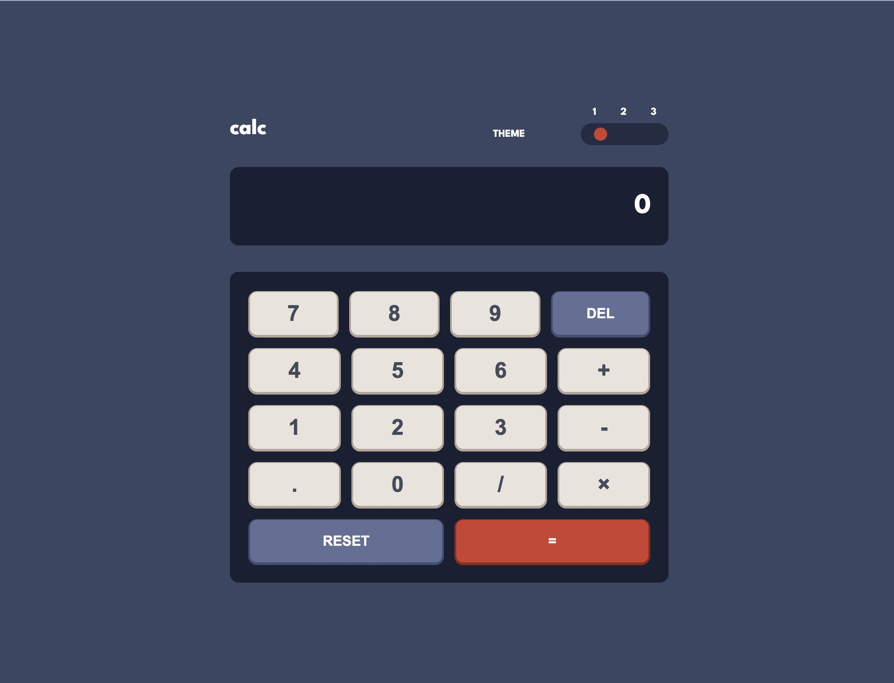

# Frontend Mentor - Calculator app solution

This is a solution to the [Calculator app challenge on Frontend Mentor](https://www.frontendmentor.io/challenges/calculator-app-9lteq5N29). Frontend Mentor challenges help you improve your coding skills by building realistic projects.

## Table of contents

-   [Overview](#overview)
    -   [The challenge](#the-challenge)
    -   [Screenshot](#screenshot)
    -   [Links](#links)
-   [My process](#my-process)
    -   [Built with](#built-with)
    -   [Continued development](#continued-development)
-   [Author](#author)

## Overview

### The challenge

Users should be able to:

-   See the size of the elements adjust based on their device's screen size
-   Perform mathmatical operations like addition, subtraction, multiplication, and division
-   Adjust the color theme based on their preference
-   **Bonus**: Have their initial theme preference checked using `prefers-color-scheme` and have any additional changes saved in the browser

### Screenshot

### Links

-   Solution URL: [https://github.com/ajay117/calculator-app](https://github.com/ajay117/calculator-app)
-   Live Site URL: [ https://ajay117.github.io/calculator-app/](https://ajay117.github.io/calculator-app/)

## My process

### Built with

-   Semantic HTML5 markup
-   CSS custom properties
-   JavaScript
-   Flexbox

### Continued development

## Author

-   Website - [Ajay KC](https://github.com/ajay117)
-   Frontend Mentor - [@ajay117](https://www.frontendmentor.io/profile/ajay117)
-   Twitter - [@Ajay49903701](https://www.twitter.com/Ajay49903701)
